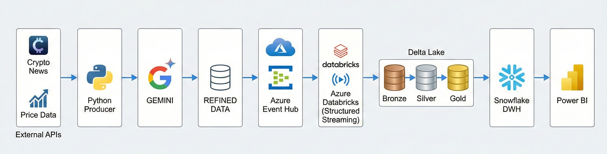
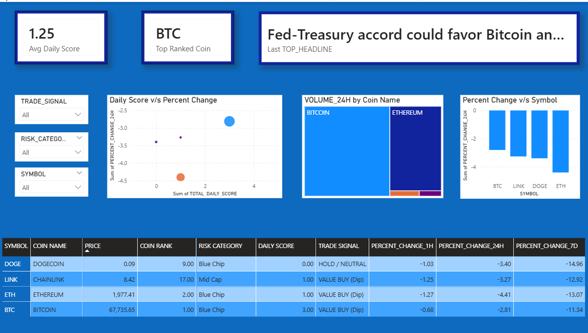

# Real-Time Crypto Sentiment Intelligence Platform  
### Streaming Data Engineering + GenAI Integration on Azure

## Live Dashboard

Access the interactive Power BI Dashboard here:
[View Live Dashboard](https://app.powerbi.com/view?r=eyJrIjoiODEwOTY2MWMtZGU1MS00MDg2LWJmZGEtNGFhNmY2OGQ0MjIwIiwidCI6IjM0YmQ4YmVkLTJhYzEtNDFhZS05ZjA4LTRlMGEzZjExNzA2YyJ9)

---

## Executive Summary

This project is a production-grade **real-time crypto sentiment intelligence platform** designed using modern data engineering best practices and enhanced with **Generative AI-powered sentiment analysis**.

It ingests live crypto news and price feeds, processes them using a streaming-first Medallion architecture, enriches them with AI-based sentiment scoring, and delivers executive-ready analytics through a BI layer.

The system is architected to reflect **FAANG-level engineering standards** — focusing on scalability, reliability, modularity, fault tolerance, and AI-native data enrichment.

---

## Problem Statement

Cryptocurrency markets react instantly to news, social signals, and macroeconomic events. Traditional batch analytics systems fail to:

- Capture real-time market sentiment
- Correlate sentiment shifts with price movements
- Deliver low-latency insights
- Scale reliably during high-volume events

This platform solves that by combining:

- Event-driven architecture
- Distributed stream processing
- Delta Lake storage
- AI-based sentiment enrichment
- Cloud-native data warehousing
- Interactive BI visualization

---

## High-Level Architecture

---

## Core Technologies

| Category | Technology |
|-----------|------------|
| Cloud Platform | Azure |
| Messaging | Azure Event Hub |
| Stream Processing | Azure Databricks (PySpark Structured Streaming) |
| Storage Format | Delta Lake |
| Data Warehouse | Snowflake |
| BI Layer | Power BI |
| AI/GenAI Layer | LLM-based Sentiment Classification |
| Architecture Pattern | Medallion Architecture |

---

## GenAI Integration – AI-Native Data Pipeline

A key differentiator of this project is the integration of **Generative AI** for dynamic sentiment classification.

### Why GenAI Instead of Rule-Based NLP?

Traditional approaches rely on:
- Static lexicons
- Pre-trained classification models
- Limited contextual awareness

This project uses a **Large Language Model (LLM)** to:

- Interpret nuanced crypto news headlines
- Detect contextual sentiment
- Classify sentiment as Positive / Negative / Neutral
- Generate structured sentiment output
- Handle ambiguous financial language

### AI-Enriched Data Example

Raw Input:
"SEC delays ETF approval decision amid regulatory concerns"

GenAI Output:
{  
"symbol": "BTC",  
"prediction": "Negative",  
"confidence": "High",  
"context_summary": "Regulatory uncertainty causing short-term bearish sentiment"  
}

### Engineering Considerations

- API call optimization
- Idempotent sentiment generation
- Structured JSON schema enforcement
- Latency-aware AI invocation
- Retry & fallback mechanism
- AI cost-conscious batching

This reflects alignment with modern **AI-first data platforms**.

---

## Medallion Architecture Implementation

### Bronze Layer – Raw Streaming Ingestion

- Event Hub → Databricks streaming read
- Raw JSON payload storage
- Append-only Delta tables
- Checkpoint-based fault tolerance
- Exactly-once semantics

Design Goals:
- Data immutability
- Replay capability
- Schema evolution tolerance

---

### Silver Layer – Cleansed & Enriched Data

Transformations include:

- JSON parsing
- Schema enforcement
- Null handling
- Deduplication
- Type casting
- Timestamp normalization
- AI-based sentiment enrichment

This layer ensures:
- Analytical consistency
- Reliable downstream modeling
- High data quality

---

### Gold Layer – Business Intelligence Models

Aggregated metrics:

- Daily sentiment score per coin
- Sentiment distribution %
- Top coin by weighted sentiment
- Sentiment vs price correlation
- Rolling 24-hour sentiment trend

Optimized for:
- BI consumption
- Query performance
- Executive dashboards

---

## Advanced Engineering Concepts Applied

### 1. Real-Time Streaming

- Structured Streaming with checkpointing
- `foreachBatch` incremental writes
- Avoided destructive operations in streaming context
- Managed streaming query exceptions
- Offset tracking & replay safety

---

### 2. Cloud-Native Scalability

- Event-driven ingestion
- Horizontal scalability via Spark clusters
- Partitioned Delta tables
- Optimized storage layout

---

### 3. Data Quality & Reliability

- API retry logic
- Structured error handling
- Streaming schema validation
- Null-safe transformations
- Idempotent processing logic

---

### 4. Warehouse Modeling (Snowflake)

- Clean analytical tables
- Proper aliasing to avoid SQL ambiguity
- Optimized aggregations
- Designed for BI performance

---

### 5. Analytical KPI Engineering

Designed custom business metrics:

- Daily Sentiment Score = Weighted aggregate of article sentiment
- Top Coin Logic = Max daily score
- Sentiment Volatility Index
- Sentiment-Price Divergence tracking

---

## Power BI Executive Dashboard

The dashboard simulates a real financial analytics product.

Features:

- Sentiment distribution (Donut/Bar)
- Coin-wise daily sentiment trends
- Top performing crypto by sentiment
- Latest AI-classified headlines (scrollable view)
- Dynamic filters by date and symbol
- Interactive slicing

Designed for:
- Decision-makers
- Traders
- Crypto analysts

---

## Performance & Optimization

- Incremental streaming ingestion
- Partition pruning
- Delta file compaction strategy
- Gold-layer aggregation to reduce BI query cost
- Controlled AI API usage to manage inference cost
- Efficient Spark transformations

---

## Engineering Tradeoffs Considered

| Challenge | Solution |
|------------|----------|
| Streaming write conflicts | Used `foreachBatch` pattern |
| Schema drift in APIs | Enforced strict schema in Silver |
| High AI latency | Batched inference calls |
| API failures | Implemented exponential retry |
| Streaming state corruption | Checkpoint isolation |

---

## Production-Readiness Enhancements (Planned)

- CI/CD deployment via Azure DevOps
- Containerized producer (Docker)
- Airflow-based orchestration
- Monitoring via Azure Monitor
- Automated anomaly alerts on extreme sentiment shifts
- ML-based price prediction model integration
- Vector database for semantic news retrieval

---

## What This Project Demonstrates (FAANG-Level Signals)

This project showcases:

- Strong distributed systems understanding
- Real-time streaming architecture expertise
- AI integration within data pipelines
- Scalable cloud-native design
- Data modeling for analytics
- End-to-end ownership from ingestion to BI
- Production-grade error handling & reliability thinking
- Business KPI engineering mindset

It reflects an ability to design systems that are:

- Scalable
- Fault-tolerant
- AI-enhanced
- Analytics-driven
- Cloud-native

---

## Conclusion

The Real-Time Crypto Sentiment Intelligence Platform demonstrates modern data engineering capabilities combined with GenAI integration — aligning with current industry trends toward AI-native data platforms.

It is not just a dashboard project.  
It is a streaming-first, AI-enriched analytics system designed with production thinking.

---

## Dashboard Preview

---

**Author:** Syed Mazahir Mehdi Zaidi
**Role:** Data Engineer  
**Focus:** Real-Time Data Systems | AI-Integrated Pipelines | Cloud Analytics | Distributed Processing
